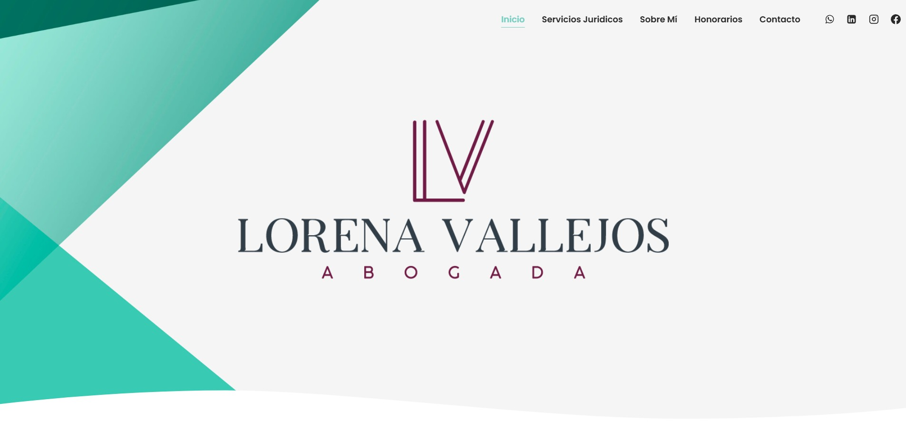
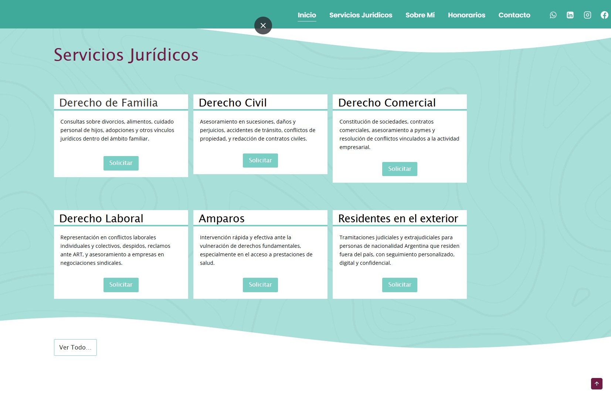
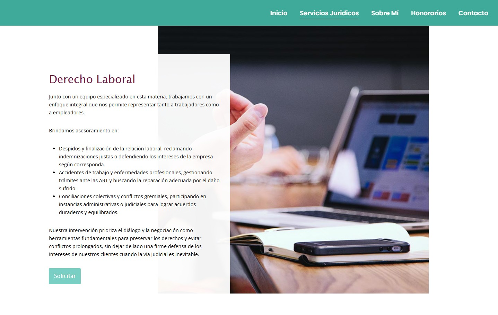
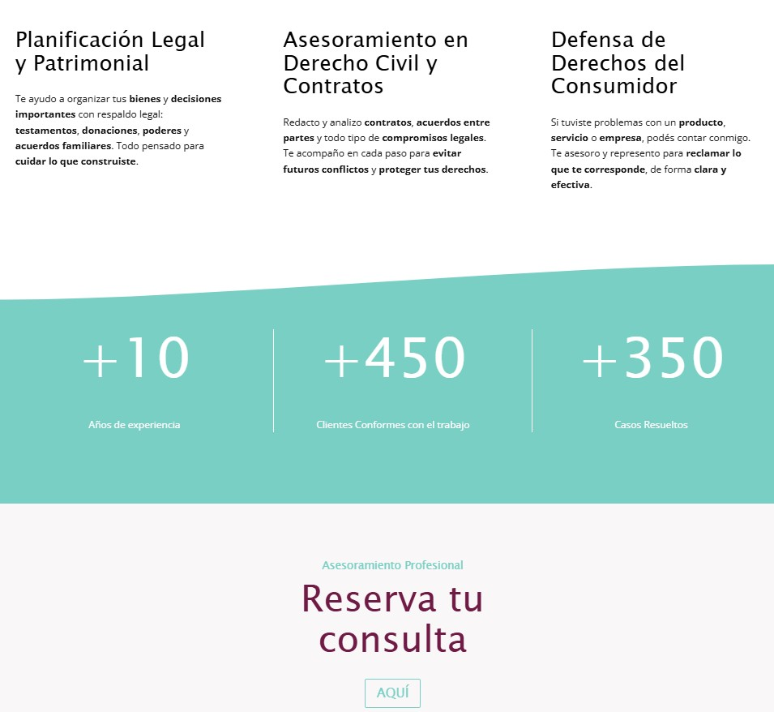

# Professional Website - Attorney Lorena Vallejos ⚖️

This project is a website designed and developed for attorney **Lorena Vallejos**, who works at a law firm specializing in various areas of law.

The site was built using **WordPress**, implementing the Kadence theme and various plugins to offer a professional, functional, and optimized experience, according to the client's needs and preferences.

🌐 **Demo online:** [lucasbonadies.infinityfreeapp.com](https://lucasbonadies.infinityfreeapp.com/)

---

## 🏛 Featured Services

* Family Law
* Civil Law
* Commercial Law
* Labor Law
* Health Protection
* Assistance for Residents Abroad (to resolve legal procedures in Argentina)

---

## 🚀 Technologies and Tools Used

* WordPress with Kadence theme
* Plugins for:

* Contact forms
* SEO Optimization
* Web Security
* Performance Optimization
* Responsive design adapted to mobile and desktop devices
* Custom customization based on the client's visual identity and preferences

---

## 📸 Screenshots

<table>
 <tr>
  <td>
   
   
   
  </td>
  <td>
   
   
   
  </td>
 </tr>
  <tr>
  <td>
  
  
   
  </td>
  <td>
   
   
   
  </td>
 </tr>
</table>

---

## 📄 Legal

This website has been developed exclusively for the law firm of Lorena Vallejos.
All content, custom design, and configuration are protected by copyright.
Copying, redistribution, or reuse without the express authorization of the developer is prohibited.

© 2025 BeLayout
